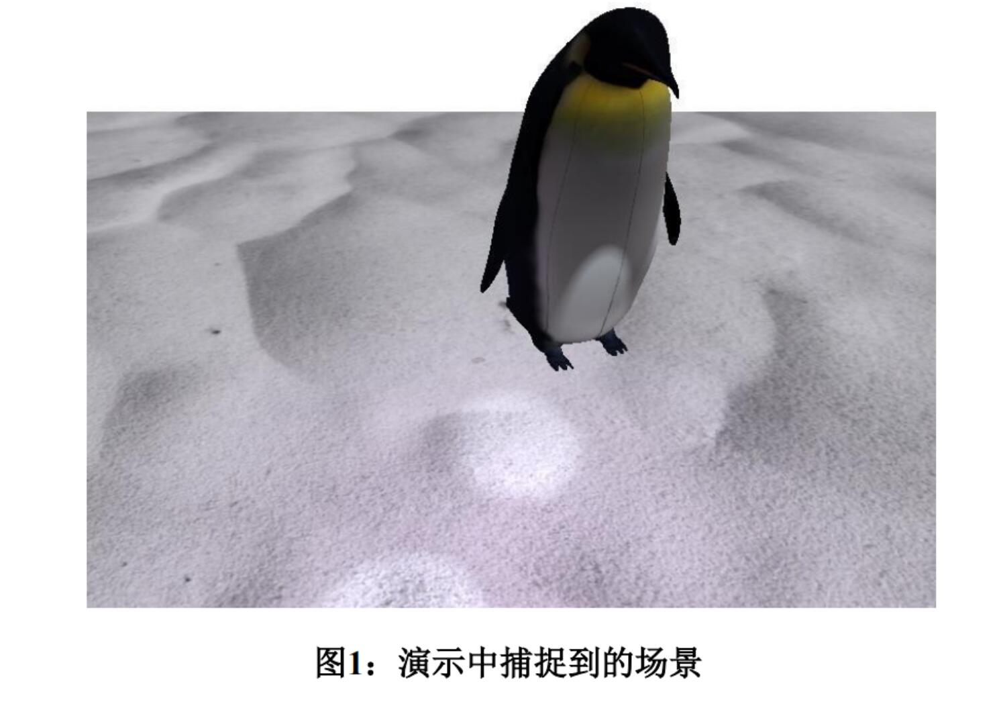
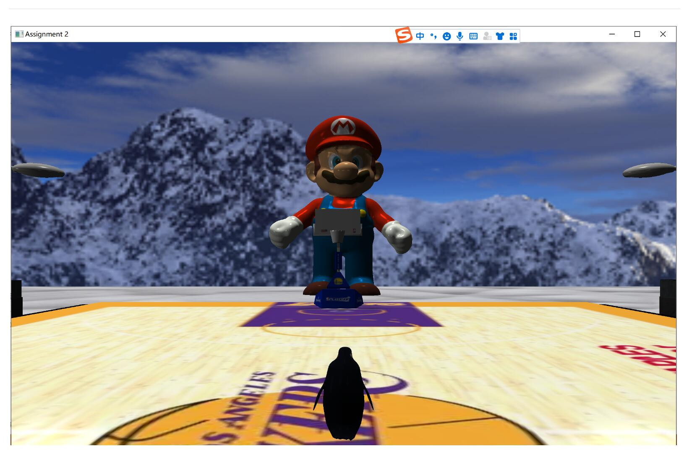
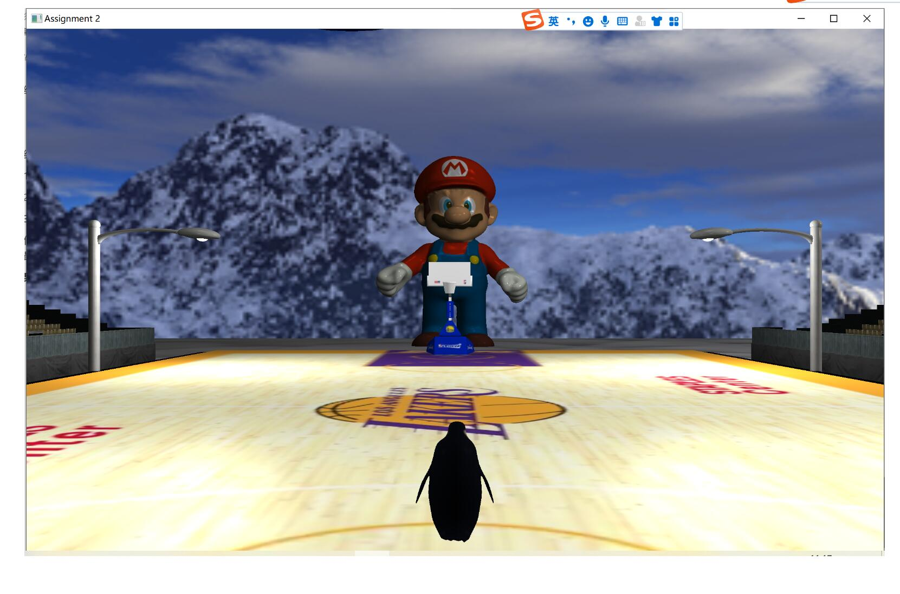

# **作业二：纹理和照明**


## 前言

完整工程文件

说实话第二次作业和第一次作业相比也没多什么东西，就是用了一些更高级点的技术（光照，纹理和3D模型等等），纯粹就是将各个模型堆在一起而已，但也完成了文档要求的所有内容。至于assimp库是从网上下载的，摄像机类和shader和texture类是从learnOpenGL这个网站抄的。凑合看看吧


## **介绍** 

在本任务中，您需要使用OpenGL构建一个更加逼真和复杂的场景。为了完成这项任务，您将在OpenGL中体验更多功能，包括照明、复杂的模型构建和加载、纹理映射和交互式事件。您将使用基本体图形 或直接从.obj文件加载三维模型，然后查看/建模变换以创建此三维场景。将使用纹理贴图和照明使场景和对象更加逼真。鼠标/键盘输入和窗口事件处理将有助于实现交互式动画。 



在该指定中，场景中有两个模型。其中一个（背景雪原）比较简单，另一个（企鹅）比较复杂。我们可以自己设计背景雪原的顶点属性。然而，对于企鹅来说，它是如此复杂，以至于我们需要通过.obj文 件加载模型。此外，雪原和企鹅被渲染成不同的纹理和灯光效果。所显示的场景可以通过用户的交互式输入来控制。您还可以丰富在指定1中创建的场景。 


## **实施详细信息**

### **任务1：加载复杂对象** 

使用Open Asset Import Library，或我们拥有的函数`Model loadOBJ(const char*objPath)`给定加载至少一个复杂模型，即演示程序中的企鹅。在本部分中，您可以通过修改`void sendDataToOpenGL()子例程来使用`Model loadOBJ（const char*objPath）`函数。 

我们在演示程序中提供了模型，即`snowfield.obj`和`penguin.obj`。我们鼓励您从Internet下载其他.obj文件或使用Blender来设计您的对象。 

（你需要检查penguin.obj，因为如果你直接画企鹅，它会非常巨大。具体来说，你需要做一些转换。）


### **任务2：纹理映射和照明** 

您需要将不同的纹理映射到两个模型，即演示程序中的雪地和企鹅。我们将使用（请参阅`依赖项/stb_image`）来加载纹理图像。您需要使用键盘交互来更改企鹅的纹理。您首先需要生成一个OpenGL纹理， 并通过修改`void texture::setupTexture(const char*texturePath)`子例程来设置纹理参数。 

然后，分别在`void sendDataToOpenGL()`和`void paintGL(void)`子例程中加载纹理并将其绑定到不同的模型。[**stb** **imagelibrary**](https://github.com/nothings/stb) 

在这里，我们还在演示程序中提供了两个模型的纹理，也鼓励您从互联网上下载其他纹理或自己绘制/过滤纹理。 

此外，3D场景应使用至少两个光源进行照明。一个应该是环境（定向）灯。对于其他光源，您可以 自己决定位置和颜色。添加此类光源的主要目的是在模型上产生漫射光和镜面光效果。您可以通过修改`void paintGL(void)`子例程来完成此操作。 


### **任务3：互动活动和动画** 

在此任务中，您需要实现以下交互式事件和动画： 

(a) **照明控制** 

按“w”键和“s”键可分别增加和减少定向光的亮度。 

(b) **纹理控制** 

按“1”和“2”键为企鹅切换两种不同的纹理，我们还提供了两种可以应用于企鹅的纹理。（即penguin/`penguin_01.jpg`，penguin/`penguin_02.jpg`） 

按“3”和“4”键可以切换雪原的两种不同纹理，我们还提供了两种可以应用于企鹅的纹理。（即雪地/`雪地_01.jpg`，雪地/`雪地_02.jpg`） 

(c) **对象控件** 

按下箭头键“↑↓←→” 

以控制企鹅的运动。具体而言，“↑↓” 

分别指示向前和向后移动。“←→”  

分别指示向左和向右旋转。（请参阅演示程序中企鹅的动画） 

(d) **视图控件** 

通过鼠标控制摄像机的视图，这意味着： 

当单击左键，鼠标上下移动时，您看到的整个场景会相应地上下移动。

（请参阅演示程序。不需要右键单击功能。） 

在本任务中，您可以修改以下子程序来实现上述要求： 

```c
void mouse_button_callback（GLFWwindow*窗口，int按钮，int操作，int mods）
{
// Sets the mouse-button callback for the current window.
}
void cursor_position_recallback（GLFWwindow*窗口，双x，双y）
{
// Sets the cursor position callback for the current window
}
void scroll_callback（GLFWwindow*窗口，双xoffset，双yoffset）
{
// Sets the scoll callback for the current window.
}
void key_callback（GLFWwindow*窗口，int键，int扫描代码，int操作，int mods）
{
// Sets the Keyboard callback for the current window.
}
```


### **额外任务：增强场景的视觉效果（最高20%）** 

OpenGL为您的程序提供了许多功能来创建各种视觉效果。你可以自己研究它们，并将它们引入作业中 

以下是一些建议的改进： 

• 加载更复杂的模型，并将其他纹理映射到它们上，以形成一个有意义的场景。(10%) 

• 使用不同类型的光源来制作有意义的场景，例如Pointlight、Spotlight等的组合（10%） 

• 复杂模型上的阴影映射。(10%) 

• 绘制点或线来跟踪其中一个复杂模型的运动。(10%) 

• 任何其他有趣的效果。


## 实现效果



夜晚开灯效果：




使用方法：

Manipulation:
Key:
Key  "ESC"：退出程序
Key  "1"：切换企鹅模型纹理
Key  "2"：切换企鹅模型纹理
Key  "3"：切换雪地模型纹理
Key  "4"：切换雪地模型纹理
Key  "W"：定向光加强
Key  "S"：定向光减弱
Key  "ENTER"：切换球场地板贴图
Key  "X"：白天和黑夜模式切换（注：白天和黑夜分别有太阳模型和月球模型在上空移动，用于模拟太阳东升西落）
Key  "Z"：球场四盏路灯的照明开关
Key  "UP"：控制企鹅前行
Key  "DOWN"：控制企鹅后退
Key  "LEFT"：控制企鹅左转
Key  "RIGHT：控制企鹅右转
Key  "SPACE：控制企鹅跳跃

//以下功能得在退出第三人称跟随时使用，如何退出请看鼠标事件
Key  "T"：控制摄像机前移
Key  "G"：控制摄像机后移
Key  "F"：控制摄像机左移
Key  "H"：控制摄像机右移

Mouse：
鼠标左键：第三人称视角跟随开关（初始默认开启）
鼠标右键：手电筒开关（需在关闭第三人称跟随时才能使用）
鼠标滑轮：控制屏幕视角大小
鼠标移动：当关闭第三人称跟随时摄像机会跟随鼠标移动而移动

//注意：本项目有个小bug，当退出第三人称视角跟随并且再次移动摄像机位置，然后再点击左键回到第三人称视角时，摄像机的主视角可能会不正对企鹅模型（或者视角丢失），需要再退出第三人称跟随然后重新调整摄像机位置和视角。


就这样吧，简简单单的一个作业。第三次就是比较有难度的。